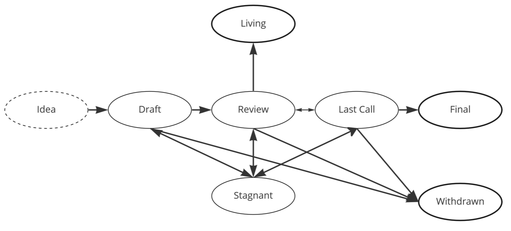

## Abstract
This specifies the process and provides guidelines for coordinating changes in Boson Protocol as an open source project. It follows similar open source styles, such as [PEPs](https://peps.python.org/), [BIP](https://github.com/bitcoin/bips) and [EIPs](https://eips.ethereum.org/). 

Proposals may range from technical changes and new features in smart contracts, modifying the protocol parameters, as well as its surrounding SDK. Before the implementation of the changes, polling the community via public voting is preferred.

## Motivation
BPIPs are intended to be the primary mechanism for proposing, tracking and discussing changes to Boson Protocol.

## Specification (including type/scope)
Each BPIP must contain three main parts: the preamble, the main section including the specification with a defined type of the proposal, and a discussion.

#### Types of BPIPs
* protocol - change of smart contracts layer
* core components - change of core components layer, SDK, 
* configuration - change of parameters’ values of deployed protocol

#### Process
BPIP process has three stages:
1. submitting a proposal and passing it through its lifecycle
2. community voting on go/no-go via Snapshot, which is optional, but preferred
3. implementation

To submit a BPIP and see it through, please follow these steps:
1. fork this repository
2. create a new bpip file in `/content/` directory, by following the guidelines in BPIP-1
3. submit a Pull Request to the `main` branch

#### BPIP editors
BPIP editors will pick up new proposals, check the syntax, do sanity checks and work with the authors and other participants to move the proposals through their lifecycle. If the proposal reaches the `Final` status, then they will evaluate if the actual implementation of the BPIP should pass the community [vote via Snapshot](https://snapshot.org/#/bosondao.eth). The list of editors can later be changed via Boson DAO.

Current editors in alphabetical order: Aditya Asgaonkar, Cliff Hall, Gregor Borosa, Jonas Seiferth, Mischa Tuffield.

BPIP editors meet on ad hoc basis to discuss and action on the backlog of BPIPs. A high quorum is required of 4/5, while voting decisions require 2/3 supermajority. Meeting minutes are recorded in a [public log](./content/BPIP-editors-call-log.md).

> Note that smart contracts might have assigned admin/upgrader roles that may or may not be the same as these editors.

#### BPIP Lifecycle
Statuses: Draft, Review, Last Call (with deadline), Voting, Final, Stagnant (if inactive for 6m), Withdrawn, Living

The poll happens after `Last Call` deadline passes, then can move to `Final` or `Withdrawn`, depending on the vote.

#### BPIP Template
Use BPIP-1 as a template for new proposals. The template mimics that of Ethereum. 

**Preamble** should contain:

|bpip number|title|author|discussions-to|status|created date|requires|

**Discussions** are preferred to be kept within this Github repository.

The preample must be followed by the **main section**:
* Abstract - A concise description of the proposal.
* Motivation - Describing motivation behind a BPIP is crucial in order to understand why a proposal is needed and the project can't cover this need as-is.
* Specification - Technical specification describes the proposed changes in a sufficient detailed that can be used as basis for in-depth discussion and later implementation. This section must also include the type of the proposal.
* Rationale - Rationale explains the proposed specification, compares it to alternative designs and should include important objections or concerns.
* Backward compatibility (optional) - If a proposal introduces backward incompatibilities, they should be described here in detail. Else this section can be omitted.
* Implementation (optional) - An optional section that contains an example implementation that can be used to assist in understanding or implementing this proposal. 
* Copyright waiver & license - The work submitted is to be in public domain.

## Rationale
BPIPs are following a common style of gathering proposals in open source projects and coordinating implementation of changes.

## Backward compatibility
/

## Implementation
/

## Copyright waiver & license
Copyright and related rights waived via [CC0](https://creativecommons.org/publicdomain/zero/1.0/).
