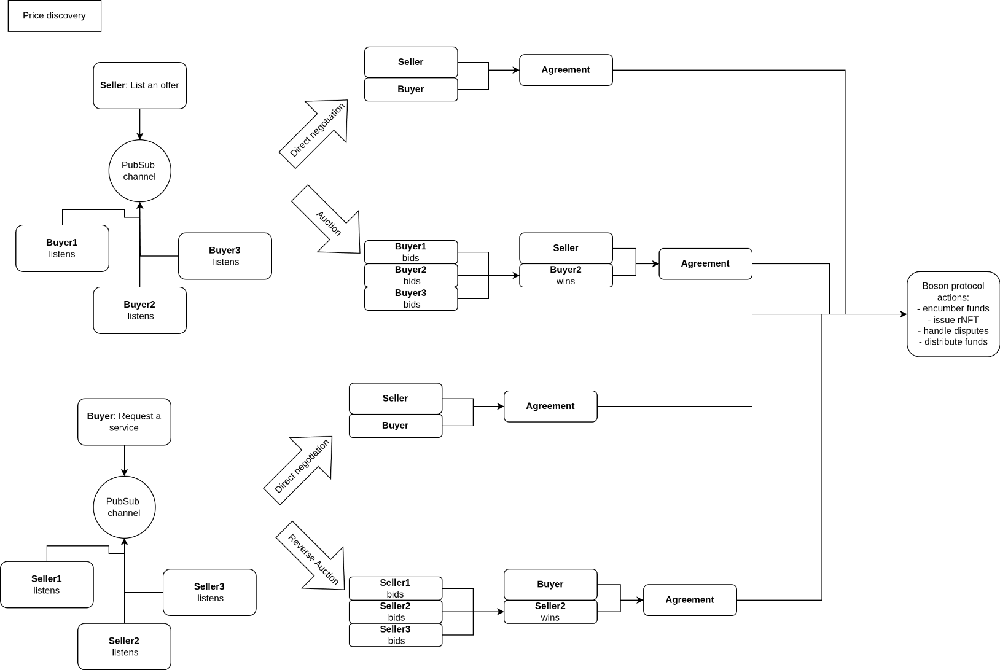

## Abstract
This proposal describes an option to do the whole listing phase (including price discovery) off-chain and only submit the agreement to Boson Protocol.

## Motivation
Currently, the exchange starts on-chain, by offer creation. This makes the offer visible to buyers, and anyone can commit to it:
- If it’s a fixed price offer, the buyer can do it without restrictions
- If it’s a price discovery offer, it depends on the discovery mechanism. In some cases, the buyer can buy it immediately, but in some cases (e.g. if the item is on auction), the seller must explicitly accept the bid, so the seller can choose who they are selling to.

The flow includes two main steps - “create offer” and “commit to the offer”. Even if the seller and the buyer decide on an exchange off-chain, they must still perform these two steps.

The protocol could be changed to also facilitate the exchanges where buyers and sellers fully agree on exchange terms before any information is stored in the protocol. Any of the involved parties could submit an agreement to the protocol, which would result in the same state as if one created an offer and the other committed to it.
The protocol role in this scenario is to validate the agreement, and do all the other actions that happen in the protocol after “commit to offer”, for example, Boson issues a tradeable rNFT, encumbers funds until the exchange finalisation and handles the disputes.

The protocol's guarantees are preserved, since the buyer still gets the guarantee to either get the item or the money back. The only part that is left out compared to the existing protocol is the discovery phase.



## Specification
#### BosonTypes
A new struct is introduced to make handling of signed offers easier.
``` solidity
    struct FullOffer {
        Offer offer;
        OfferDates offerDates;
        OfferDurations offerDurations;
        DRParameters drParameters;
        Condition condition;
        uint256 agentId;
        uint256 feeLimit;
        bool useDepositedFunds;
    }
```

#### IBosonExchangeHandler

A new method that combines `createOffer` and `commitToOffer` is added to the protocol.
There is no distinction between static offer and price-discovery offer - it is irrelevant since all funds are encumbered at the same time the offer is created. 
When this offer is created the buyer gets `quantity` of rNFTs.

```diff solidity
      /**
     * @notice Creates an offer and commits to it immediately.
     * The caller is the committer and must provide the offer creator's signature.
     *
     * Emits an OfferCreated, FundsEncumbered, BuyerCommitted and SellerCommitted event if successful.
     *
     * Reverts if:
     * - The offers region of protocol is paused
     * - Valid from date is greater than valid until date
     * - Valid until date is not in the future
     * - Both voucher expiration date and voucher expiration period are defined
     * - Neither of voucher expiration date and voucher expiration period are defined
     * - Voucher redeemable period is fixed, but it ends before it starts
     * - Voucher redeemable period is fixed, but it ends before offer expires
     * - Dispute period is less than minimum dispute period
     * - Resolution period is not between the minimum and the maximum resolution period
     * - Voided is set to true
     * - Available quantity is 0
     * - Dispute resolver wallet is not registered, except for absolute zero offers with unspecified dispute resolver
     * - Dispute resolver is not active, except for absolute zero offers with unspecified dispute resolver
     * - Seller is not on dispute resolver's seller allow list
     * - Dispute resolver does not accept fees in the exchange token
     * - Buyer cancel penalty is greater than price
     * - Collection does not exist
     * - When agent id is non zero and the agent does not exist
     * - If the sum of agent fee amount and protocol fee amount is greater than the offer fee limit determined by the protocol
     * - If the sum of agent fee amount and protocol fee amount is greater than fee limit set by seller
     * - Royalty recipient is not on seller's allow list
     * - Royalty percentage is less than the value decided by the admin
     * - Total royalty percentage is more than max royalty percentage
     * - Not enough funds can be encumbered
     *
     * @param _fullOffer - the fully populated struct containing offer, offer dates, offer durations, dispute resolution parameters, condition, agent id and fee limit
     * @param _offerCreator - the address of the other party
     * @param _committer - the address of the committer (buyer for seller-created offers, seller for buyer-created offers)
     * @param _signature - signature of the other party. If the signer is EOA, it must be ECDSA signature in the format of (r,s,v) struct, otherwise, it must be a valid ERC1271 signature.
     * @param _conditionalTokenId - the token id to use for the conditional commit, if applicable
     * @param _sellerParams - the seller-specific parameters (collection index, royalty info, mutualizer address), if applicable
     */
    function createOfferAndCommit(
        BosonTypes.FullOffer calldata _fullOffer,
        address _offerCreator,
        address payable _committer,
        bytes calldata _signature,
        uint256 _conditionalTokenId,
        BosonTypes.SellerOfferParams calldata _sellerParams
    ) external payable;
```

#### IBosonOfferHandler
If either seller or buyer signed the offer off-chain, but later decided to opt out of the offer, and the other party have not used it yer, the signer can void the offer and makes in unfulfillable.

```solidity
/**
     * @notice Voids a non-listed offer. (offers used in `createOfferAndCommit`)
     * It prevents the offer from being used in future exchanges even if it was already signed.
     *
     * Emits a NonListedOfferVoided event if successful.
     *
     * Reverts if:
     * - The offers region of protocol is paused
     * - Caller is not the assistant of the offer
     * - Offer has already been voided
     *
     * @param _fullOffer - the fully populated struct containing offer, offer dates, offer durations, dispute resolution parameters, condition, agent id and fee limit
     */
    function voidNonListedOffer(BosonTypes.FullOffer calldata _fullOffer) external;

    /**
     * @notice Voids multiple non-listed offers. (offers used in `createOfferAndCommit`)
     * It prevents the offers from being used in future exchanges even if they were already signed.
     *
     * Emits NonListedOfferVoided events if successful.
     *
     * Reverts if:
     * - The number of elements in offers, offerDates, offerDurations, disputeResolverIds, agentIds and feeLimits do not match
     * - The offers region of protocol is paused
     * - Caller is not the authorized to void the offer
     * - Offer has already been voided
     *
     * @param _fullOffers - the list fully populated structs containing offer, offer dates, offer durations, dispute resolution parameters, condition, agent id and fee limit
     */
    function voidNonListedOfferBatch(BosonTypes.FullOffer[] calldata _fullOffers) external;
```

## Rationale
The buyer and seller can agree on an exchange off-chain, but if they want the protection offered by Boson, they must enter the protocol at the commitment point. All offer data must still be provided, since the real world exchange does not happen atomically, and the protocol needs all the information that is normally needed in the case of (escalated) dispute.  

This approach adds the efficiency to the exchange flow since it does not require from seller to create an offer, that might never be fulfilled. Additionally, the participants do not have to provide the funds upfront, since they are all encumbered at the commitment time.  

If one of the committers already agreed on an exchange (i.e. they signed the agreement), they can opt-out without any penalty before it is submitted on-chain. The protocol must provide a method, where the offer can be voided before it is even created.

## Backward compatibility
This specification does not break backward compatibility.

## Implementation
* Add another storage variable `mapping(bytes32=>uint256) offerIdByHash`
* Create offer and commit
  * Calculate hash of offer parameters and caller's address. 
  * If offer was validated already:
     * If offer was voided, revert
     * Continue to `commitToOffer` step.
  * Validate signature validity (ECSDA signature for EOA or EIP1271 contract signature if not EOA). If validation fails, revert.
  * Perform all the validations done in `createOffer`
  * Perform all the validations done in `commitToOffer`
  * In `commitToOffer` the party that created the offer needs to provide its payment upfront. In this `createOfferAndCommit` the creator can choose:
    * To use its available funds (already in the protocol). This must be used if the exchange token is the native token and amount to be encumbered is greater than 0.
    * To approve the protocol to transfer the funds, which are encumbered at the same time as the callers. 
* Void offer
  * Calculate hash of offer parameters and other committer's address. Validate signature validity (ECSDA signature for EOA or EIP1271 contract signature if not EOA). If validation fails, revert.
  * Set `offerIdByHash[hash]=VOIDED_OFFER_ID`, where `VOIDED_OFFER_ID` is max value of uint256 type.

### Security considerations

None.
  
## Copyright waiver & license
Copyright and related rights waived via [CC0](https://creativecommons.org/publicdomain/zero/1.0/).
