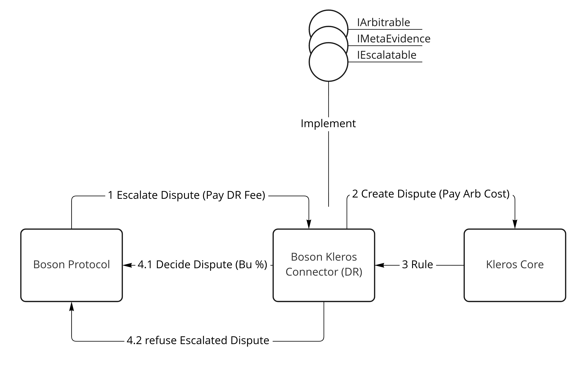
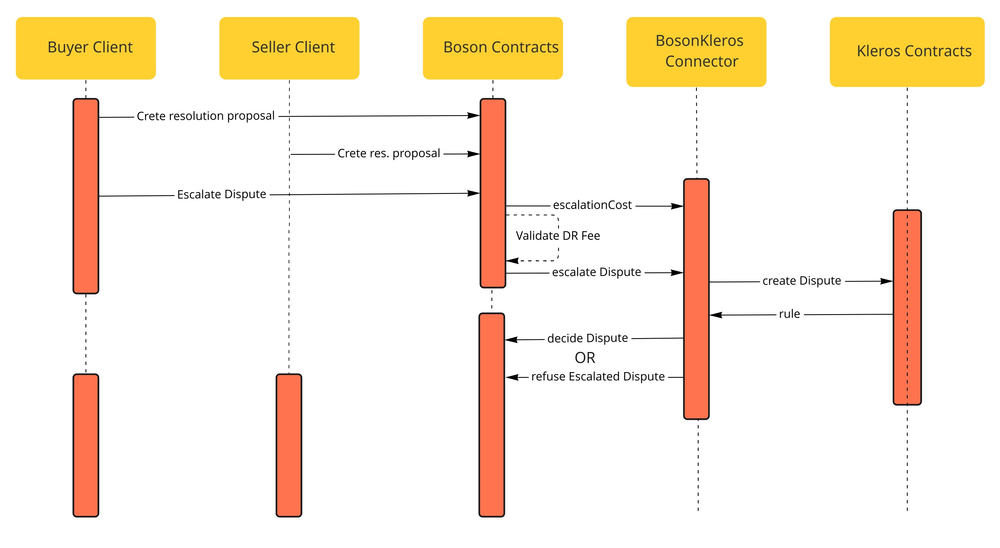

## Abstract

The following proposal outlines the integration of Kleros Protocol with Boson Protocol as a decentralized Dispute Resolver (DR). In Boson Protocol, DR serves as the last resort for dispute resolution when mutual resolution between buyer and seller fails.

## Motivation

As Boson Protocol follows the path of progressive decentralization, it's important to ensure that there is no full dependencies on centralized parties.

Boson Protocol enables trust-minimized commercial transactions. In case a dispute arises between the counterparites about the exchange, the two-step dispute resolution is appled: mutual resolution and escalation dispute resolution.

Escalated dispute resolution creates a centralized element in the protocol. In some use cases a centralized DR is good enough to resolve a disagreement between counterparties. But there are use cases when a centralized DR may jeopardize trust. Therefore an option to use an incentive-compatible decentralized DR is important. Kleros Protocol is one of the most tested and widely used decentralized dispute resolution systems on-chain.

## Specification

In order to implement integration of Kleros Protocol the following changes have to be made

- Expose interfaces for an external system to interact with the escalated dispute resolution process
- Add changes to keep the state of buyer and seller mutual resolution proposals on-chain
- Develop a "Connector" smart contract that implements `IArbitrable`, `IMetaEvidence` and `IEvidence` Kleros interfaces, and Boson Protocol `IEscalatable` interface
- Create a dedicated marketplace sub-court by submitting a proposal to the Kleros DAO

### Boson Protocol Changes

**IEscalatable interface**

Add new interface that must be implemented by an external "Connector" smart contract.

```solidity
interface IEscalatable {
    function escalateDispute(
        uint256 _exchangeId,
        uint256 _buyerPercent,
        uint256 _sellerPercent
    ) external;

    function escalationCost() external returns (uint256 _cost);
}
```

**IEscalationResolver**

Add `IEscalationResolver` that decomposes the `IBosonDisputeHandler` into two separate interfaces.

```solidity
interface IEscalationResolver {
    function decideDispute(uint256 _exchangeId, uint256 _buyerPercent) external;

    function refuseEscalatedDispute(uint256 _exchangeId) external;
}
```

**contracts/interfaces/handlers/IBosonDisputeHandler.sol**

Modification to the existing IBosonDisputeHandler interface.

```solidity

    /**
     * @notice Resolves a dispute by providing the information about the funds split.
     * Callable by the buyer and seller
     * @param _exchangeId  - the id of the associated exchange
     * @param _percent - percentage of the pot that goes to the buyer
     */
    function proposeResolution(uint256 _exchangeId, uint256 _percent) external;
```

## Rationale

Add a new interface `IEscalatable` that must be implemented by an external "Connector" smart contract. It communicates resolution proposals from buyer and seller to an external DR system, along with the unique Boson Protocol exchange identifier. The proposals should not add up to 100%, indicating the buyer and the seller's disagreement.

Another new `IEscalationResolver` extracts the power to decide or refuse a dispute from the original `IBosonDisputeHandler` to a separate interface. It minimizes access to the dispute handler methods by an external system, in this case - Kleros "Connector".

Currently, Kleros smart contracts don't allow external systems to choose from an arbitrary amount of options, like 100, which could be 100% in the case of Boson Protocol. That's why the current integration of Kleros requires a mechanism to store a state of proposals from the buyer and seller before it can be escalated to Kleros.

The original method for mutual resolution `resolveDispute` could be used to simultaneously communicate a buyer's or seller's proposal and finalize a dispute in case a match is detected.

But for the backwards compatibility reasons it is not recommended to modify the signature of that method, hence it can only be used to signal mutual resolution between the buyer and the seller to Boson Protocol once an agreement has been reached off-chain.

Hence, it's recommended to add another method `proposeResolution` that allows storing a mutual resolution proposal from a buyer or a seller on-chain, that can be used for escalation. In case proposals from the counterparties match - the dispute can be resolved automatically.

_Note: Alternatively, the `esclateDispute` method can be modified, but it seems less reasonable_

## Diagrams





## Backward compatibility

The design of this BPIP takes into account backwards compatibility and proposes not to modify existing methods to avoid issues with the exisiting implementation.

## Implementation

The implementation contains an early draft and is not fully aligned with this BPIP. But it can be used for information purposes.
https://github.com/bosonprotocol/boson-protocol-contracts/pull/488/

## Copyright waiver & license

Copyright and related rights waived via [CC0](https://creativecommons.org/publicdomain/zero/1.0/).
