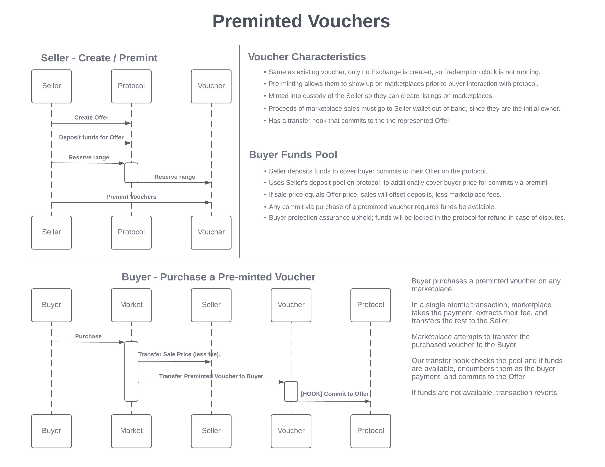

## Abstract
This proposal describes a new feature which allows sellers to pre-mint vouchers, making them available for primary purchase on NFT marketplaces.

## Motivation
Ordinarily, sellers on Boson Protocol create offers, which buyers then commit to, resulting in the issuance of a voucher (aka, a redeemable NFT or rNFT). Vouchers can be resold on secondary markets or redeemed to receive the merchandise.

Since the vouchers don’t exist until buyers commit to the protocol, traffic must be driven to the seller’s site or the Boson Dapp for primary market purchases. Meanwhile, popular marketplaces and destinations such as metaverses, already have a high traffic volume.

In order to help sellers capture that potential market, we propose to solve this "chicken and egg" problem with a new feature called pre-minted vouchers.

## Specification
#### IBosonVoucher
The following methods are added.
```solidity
    /**
     * @notice Reserves a range of vouchers to be associated with an offer
     *
     * Must happen prior to calling preMint
     * Caller must have PROTOCOL role.
     *
     * Reverts if:
     * - Start id is not greater than zero for the first range
     * - Start id is not greater than the end id of the previous range for subsequent ranges
     * - Range length is zero
     * - Range length is too large, i.e., would cause an overflow
     * - Offer id is already associated with a range
     * - _to is not the contract address or the contract owner
     *
     * @param _offerId - the id of the offer
     * @param _start - the first id of the token range
     * @param _length - the length of the range
     * @param _to - the address to send the pre-minted vouchers to (contract address or contract owner)
     */
    function reserveRange(
        uint256 _offerId,
        uint256 _start,
        uint256 _length,
        address _to
    ) external;

    /**
     * @notice Pre-mints all or part of an offer's reserved vouchers.
     *
     * For small offer quantities, this method may only need to be
     * called once.
     *
     * But, if the range is large, e.g., 10k vouchers, block gas limit
     * could cause the transaction to fail. Thus, in order to support
     * a batched approach to pre-minting an offer's vouchers,
     * this method can be called multiple times, until the whole
     * range is minted.
     *
     * A benefit to the batched approach is that the entire reserved
     * range for an offer need not be pre-minted at one time. A seller
     * could just mint batches periodically, controlling the amount
     * that are available on the market at any given time, e.g.,
     * creating a pre-minted offer with a validity period of one year,
     * causing the token range to be reserved, but only pre-minting
     * a certain amount monthly.
     *
     * Caller must be contract owner (seller assistant address).
     *
     * Reverts if:
     * - Offer id is not associated with a range
     * - Amount to mint is more than remaining un-minted in range
     * - Too many to mint in a single transaction, given current block gas limit
     *
     * @param _offerId - the id of the offer
     * @param _amount - the amount to mint
     */
    function preMint(uint256 _offerId, uint256 _amount) external;

    /**
     * @notice Burn all or part of an offer's preminted vouchers.
     * If offer expires or it's voided, the seller can burn the preminted vouchers that were not transferred yet.
     * This way they will not show in seller's wallet and marketplaces anymore.
     *
     * For small offer quantities, this method may only need to be
     * called once.
     *
     * But, if the range is large, e.g., 10k vouchers, block gas limit
     * could cause the transaction to fail. Thus, in order to support
     * a batched approach to pre-minting an offer's vouchers,
     * this method can be called multiple times, until the whole
     * range is burned.
     *
     * Caller must be contract owner (seller assistant address).
     *
     * Reverts if:
     * - Offer id is not associated with a range
     * - Offer is not expired or voided
     * - There is nothing to burn
     *
     * @param _offerId - the id of the offer
     */
    function burnPremintedVouchers(uint256 _offerId) external;

    /**
     * @notice Gets the number of vouchers available to be pre-minted for an offer.
     *
     * @param _offerId - the id of the offer
     * @return count - the count of vouchers in reserved range available to be pre-minted
     */
    function getAvailablePreMints(uint256 _offerId) external view returns (uint256 count);

    /**
     * @notice Gets the range for an offer.
     *
     * @param _offerId - the id of the offer
     * @return range - range struct with information about range start, length and already minted tokens
     */
    function getRangeByOfferId(uint256 _offerId) external view returns (Range memory range);
```

#### IBosonExchangeHandler
The following method is added.
```solidity
    /**
     * @notice Commits to a preminted offer (first step of an exchange).
     *
     * Emits a BuyerCommitted event if successful.
     *
     * Reverts if:
     * - The exchanges region of protocol is paused
     * - The buyers region of protocol is paused
     * - Caller is not the voucher contract, owned by the seller
     * - Exchange exists already
     * - Offer has been voided
     * - Offer has expired
     * - Offer is not yet available for commits
     * - Buyer account is inactive
     * - Buyer is token-gated (conditional commit requirements not met or already used)
     * - Seller has less funds available than sellerDeposit for non preminted offers
     * - Seller has less funds available than sellerDeposit and price for preminted offers
     *
     * @param _buyer - the buyer's address (caller can commit on behalf of a buyer)
     * @param _offerId - the id of the offer to commit to
     * @param _exchangeId - the id of the exchange
     */
    function commitToPreMintedOffer(
        address payable _buyer,
        uint256 _offerId,
        uint256 _exchangeId
    ) external;
```

#### IBosonOfferHandler
The following method is added.
```solidity
    /**
     * @notice Reserves a range of vouchers to be associated with an offer
     *
     *
     * Reverts if:
     * - The offers region of protocol is paused
     * - The exchanges region of protocol is paused
     * - Offer does not exist
     * - Offer already voided
     * - Caller is not the seller
     * - Range length is zero
     * - Range length is greater than quantity available
     * - Range length is greater than maximum allowed range length
     * - Call to BosonVoucher.reserveRange() reverts
     *
     * @param _offerId - the id of the offer
     * @param _length - the length of the range
     */
    function reserveRange(uint256 _offerId, uint256 _length) external;
```
#### IBosonOrchestrationHandler
For convenience, all orchestration methods that allow offer creation, get a counterpart method that allow range reservation at the same time. Seller needs to provide an additional input which tells how many vouchers can be preminted. New methods are
These methods are not essential for this BPIP, so full specification is not provided. Revert reasons, events emitted and input parameters are union of revert reasons, events emitted and input parameters of base functions, combined in given orchestration function. List of suggested orchestration methods:
- createSellerAndPremintedOffer
- createPremintedOfferWithCondition
- createPremintedOfferAddToGroup
- createPremintedOfferAndTwinWithBundle
- createPremintedOfferWithConditionAndTwinAndBundle
- createSellerAndPremintedOfferWithCondition
- createSellerAndPremintedOfferAndTwinWithBundle
- createSellerAndPremintedOfferWithConditionAndTwinAndBundle


## Interactions 


## Rationale
Vouchers, which are ERC721 NFTs, show on marketplaces as soon as they are minted. Currently, vouchers are minted at the same time when an exchange is created, which means that whenever they are resold on a secondary market, the new buyer does not get full redemption period (i.e. transfer does not reset the timers in the protocol). In order to allow buyers on any marketplace to get full dispute period when they are the first owner of the voucher, we need a different solution. 

One possible approach is to create a dedicated bridge contract, where sellers could create NFTs that would show on marketplaces. When buyers on marketplace bought them, this bridge NFT would be burnt and buyers would get redeemable voucher instead. However this approach breaks user flow in some marketplaces and might be questionable since the buyer gets a different NFT than was actually bought. This challenges current marketplace UX and was deemed to potentially be confusing to buyer of said redeemable.

Another approach was to enable mint on demand directly on voucher contract. Although it does not suffer the same limitations as the previous approach, mint is not a standard ERC721 function, so compatibility with all marketplaces would be hard to achieve.

This leads to this proposal, where vouchers are preminted directly on existing voucher contract. Their existence automatically means they can be transferred as regular ERC721 NFTs, so they can be sold on any marketplace. Compared to the first approach, the voucher here is not burned but simply transferred to a new owner (i.e. first buyer). This first transfer invokes `commitToPremintedOffer` on the protocol, which starts the exchange and effectively converts preminted voucher into a true voucher. After that, the voucher behaves as other vouchers, i.e. dispute period starts at the time of the purchase, the voucher can be redeemed, transferred, etc.
Important to note here is that we now have two types of vouchers in the voucher contract:
- preminted vouchers, with no exchange associated and
- true vouchers, with exactly one exchange associated.
  
In current protocol, all vouchers are issued when the protocol invokes `issueVoucher` method. In this proposal, we add an additional method `preMint` which allows the seller (assistant) to issue a desired number of vouchers.
Since currently it holds that the exchange id (in the protocol) always matches the token id (in voucher contract), it's desired that this stays even with premint. To achieve it, we propose a method to reserve range (`reserveRange`), which effectively reserves a desired number of exchange ids in the protocol. Then whenever a preminted voucher is converted into a true voucher, it keeps its token id and gets the matching exchange id in the protocol.

Although range reservation ultimately happens via voucher contracts, the method must be invoked through the protocol. That way, it can be ensured that the amount of preminted vouchers never exceeds the quantity available, set in the offer.

When the offer expires or is voided buyers can no longer commit to them anymore. However, with preminted vouchers, it's possible that some of them were not bought before they are rendered useless. In this case, the protocol should also prevent committing to the offer via these pre-minted voucher. In this case some unusable vouchers will be stuck in the contract and possibly on marketplaces. To delist them, we suggest a method to burn all preminted vouchers (`burnPremintedVouchers`) that cannot be redeemed anymore.

Given that with pre minted voucher the buyer does not directly interact with the protocol, this opens the question of how do we ensure the protocol's exchange guarantees (i.e. possibility of getting funds back if something goes wrong). The proposed solution is that now the seller needs to provide enough funds to cover both the item price and the seller deposit within the seller pool. This immediately ensures buyer protection but increases a seller's capital requirements. However, this drawback is not too big, since as soon as the marketplace exchange happens, the seller receives the funds, which can be directly used to cover the item price in subsequent sales. Moreover, as soon as some exchanges are finalized and funds are released back into the seller's pool, those funds can be automatically used to cover future sales.

This proposal might raise some efficiency concerns around the minting of multiple ERC721s, as these are relatively costly operations. ERC1155 was considered as an alternative, but it turned out that with it it's impossible to maintain a nice exchange id and token id equivalence. To overcome the problem of ERC721 inefficiency, we proposed another solution. Since premint always assigns token ownership to the voucher contract owner (or to the contract itself), there is no need to explicitly store its address during the premint phase (saving massively on storage costs). It's enough that only correct transfer events are emitted, while general consistency is achieved by overriding ERC721 `ownerOf`, `transferFrom` and `safeTransferFrom` methods to correctly manage all tokens that were preminted.

## Backward compatibility
This specification does not break backward compatibility.

Still it is important that when the upgrade is done, voucher contracts are upgraded before the protocol is upgraded.

## Implementation
### BosonVoucher

* Range reservation
  * Must be done before preminting can happen.
  * Ranges must be strictly increasing, i.e. start of a new range must be greater than the current highest range.
  * Range's owner (parameter `_to`) must be either the voucher contract itself or its owner.
  * Store information about the associated offer id, range start, and range length.
  * The tracking of reserved ranges enables that exchange id (in the protocol) and token id (voucher contract) can remain the same.
* Preminting
  * Can be done in batches. This allows to premint the quantities that could otherwise not be possible because of the block gas limit. Additionally, it allows sellers to only partially release vouchers to the market.
  * Preminting is always done to the contract owner's address. It emits events that look as if vouchers have been minted, but don't store the owner's address to conserve the bulk of an actual minting's gas. 
  * Preminting always mints consecutive token ids, starting with the lowest non-minted id in the range.
* Token ownership
  * Change ERC721 method `ownerOf`, so it properly reports the correct owner.
  * If the token id is in a reserved range, and has already been preminted, but not yet transferred or burned, report the contract owner (the seller) as the owner of the voucher.
  * In other cases, return the true owner if it exists, or revert otherwise.
* Preminted voucher transfer
  * When a preminted voucher is transferred for the first time, detect it in before transfer hook it, and call the commitToPremintedOffer protocol method, which does not require payment.
  * In all subsequent transfers, treat the voucher as normal, i.e. call `onVoucherTransferred` protocol method.
  * Since all inhered transfer methods (`transferFrom` and `safeTranferFrom`) revert if the token id has no owner, it needs to be temporarily updated whenever first transfer of preminted voucher.
* Burn preminted vouchers
  * Preminted vouchers can be burned when the offer expires or is voided.
  * Burning allows owners to remove unusable vouchers from their wallets.

* Implemented [here](https://github.com/bosonprotocol/boson-protocol-contracts/pull/483).


### Protocol
Offer creation remains the same as it was in previous versions. To enable preminted vouchers for an offer, the seller just needs to call the `reserveRange` method in the protocol, which effectively converts the offer into a (partially) preminted offer.
Offer can be
  - fully preminted: reserved range matches initial quantity available. It makes it impossible to commit to an offer directly.
  - partially preminted: the reserved range is less than the quantity available. It is possible to commit to the offer directly on the protocol or through a primary transfer of a preminted voucher.
  - not preminted: there is no reserved range for the offer. The only way to commit is directly on the protocol (same as in the current protocol version).

Reserve range can be called once per offer, so the seller must in advance decide how many vouchers can be preminted. Reserve range accepts only the offer id and range length, while range start is determined based on the current exchange id. Calling `reserveRange` decreases the quantity available and increases the exchange id counter in the protocol. This means that it is now possible that the exchange with a higher id is created before the exchange with a lower id.

The decision if the offer will support preminted vouchers or not does not need to be decided at offer creation time. Even if some users already commit to an offer, the seller can reserve a range, as long as the quantity available is greater than 0.
If a seller wants to create an offer and reserve range in single transaction, they can use orchestration methods that enable it.

* Implemented [here](https://github.com/bosonprotocol/boson-protocol-contracts/pull/490).
  
## Copyright waiver & license
Copyright and related rights waived via [CC0](https://creativecommons.org/publicdomain/zero/1.0/).
