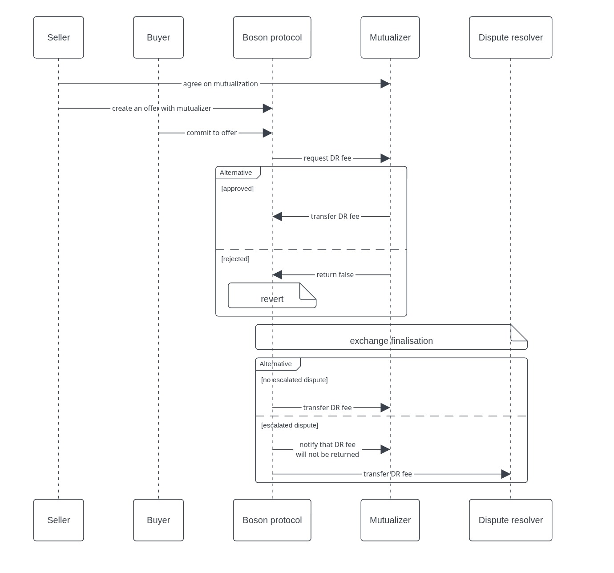

## Abstract
This proposal describes a minimal interface to support mutualization of dispute resolver fees.

## Motivation
Dispute resolver fee is paid for the service provided by the Dispute resolver. The simplest approach is that either seller or buyer pays it, but none of them is suitable:
- If the seller has contributed towards the fee, a buyer is unilaterally able to cause the seller a loss by calling `escalate`.
- If the buyer has contributed towards the fee, the Buyer is discouraged from calling `escalate` because that action will incur them a cost.

A solution to this problem is to mutualize the dispute resolution fees (DRF) by creating an open market that covers the fee when dispute resolution services are sought.
It's possible to insure either buyers or sellers. In both cases, they pay a premium to the mutualizer, which then bears the cost of escalated dispute resolution if it comes to it.
Given that the sellers are expected to be permanently present in the system, while some buyers will be only one-time users, it makes more sense to mutualize across the sellers.

Mutualizer is a contract external to the protocol. It can specify arbitrary policies and can implement custom business logic.
To be compatible with the protocol it must implement the methods to send the DR fee to the protocol when requested and must be able to receive the outcome of the dispute resolution.

This BPIP proposes the following interfaces:
- a minimal mutualizer interface. This is the interface that is used by the protocol to request DR fee from the mutualizer and to communicate back the final outcome.
- a mutualizer client interface. This is used by the mutualizer owner to deposit and withdraw funds and to create and void agreements. It is also used by the sellers to create or void agreements.

The interactions between mutualizer, seller and protocol are presented in the following diagram:



1. Seller and mutualizer first agree on mutualization and store the information on the mutualizer contract.
2. When the buyer commits to an offer, the DR fee is pulled from the mutualizer and locked in the protocol
   1. If the mutualizer cannot provide the fee, the commit fails and the state is reverted (no buyer/seller funds get locked, and no voucher is issued) 
3. When an exchange is finalised, the DR fee is released to:
   1. *Dispute resolver* if a dispute was raised and escalated and the resolver did not refuse to resolve
   2. *Mutualizer* if no dispute was raised or dispute was raised and the resolver refused to resolve.


## Specification
#### Minimal DR Fee Mutualizer interface

```solidity
/**
 * @title IDRFeeMutualizer
 * @notice Interface for dispute resolver fee mutualization
 *
 * The ERC-165 identifier for this interface is: 0x1e0b3a78
 */
interface IDRFeeMutualizer is IERC165 {
    /**
     * @notice Checks if a seller is covered for a specific DR fee
     * @param _sellerId The seller ID
     * @param _feeAmount The fee amount to cover
     * @param _tokenAddress The token address (address(0) for native currency)
     * @param _disputeResolverId The dispute resolver ID (0 for universal agreement covering all dispute resolvers)
     * @return bool True if the seller is covered, false otherwise
     * @dev Checks for both specific dispute resolver agreements and universal agreements (disputeResolverId = 0).
     */
    function isSellerCovered(
        uint256 _sellerId,
        uint256 _feeAmount,
        address _tokenAddress,
        uint256 _disputeResolverId
    ) external view returns (bool);

    /**
     * @notice Requests a DR fee for a seller
     * @param _sellerId The seller ID
     * @param _feeAmount The fee amount to cover
     * @param _tokenAddress The token address (address(0) for native currency)
     * @param _exchangeId The exchange ID
     * @param _disputeResolverId The dispute resolver ID (0 for universal agreement)
     * @return success True if the request was successful, false otherwise
     * @dev Only callable by the Boson protocol. Returns false if seller is not covered.
     *
     * Emits a {DRFeeProvided} event if successful.
     *
     * Reverts if:
     * - Caller is not the Boson protocol
     * - feeAmount is 0
     * - Pool balance is insufficient
     * - ERC20 or native currency transfer fails
     */
    function requestDRFee(
        uint256 _sellerId,
        uint256 _feeAmount,
        address _tokenAddress,
        uint256 _exchangeId,
        uint256 _disputeResolverId
    ) external returns (bool success);

    /**
     * @notice Returns a DR fee to the mutualizer
     * @param _exchangeId The exchange ID
     * @param _feeAmount The amount being returned (0 means protocol kept all fees)
     * @dev Only callable by the Boson protocol. For native currency, feeAmount must equal msg.value.
     *
     * Emits a {DRFeeReturned} event.
     *
     * Reverts if:
     * - Caller is not the Boson protocol
     * - exchangeId is not found
     * - msg.value != feeAmount for native currency
     * - msg.value > 0 for ERC20 tokens
     * - ERC20 or native currency transfer fails
     */
    function returnDRFee(uint256 _exchangeId, uint256 _feeAmount) external payable;
}
```

#### DR Fee Mutualizer Client interface

```solidity
/**
 * @title DRFeeMutualizer
 * @notice Reference implementation of DR Fee Mutualizer with exchange token-based agreement management and meta-transaction support
 *
 * The ERC-165 identifier for this interface is: 0xfde8ce04
 *
 * @dev This contract provides dispute resolver fee mutualization with configurable agreements per seller + exchange token + dispute resolver.
 *      Each seller can have agreements for different exchange tokens and dispute resolvers. Universal agreements can be created by setting disputeResolverId=0.
 */
interface IDRFeeMutualizerClient is IDRFeeMutualizer {
    struct Agreement {
        uint256 maxAmountPerTx;
        uint256 maxAmountTotal;
        uint256 timePeriod;
        uint256 premium; // Premium amount to be paid by seller
        address tokenAddress; // Token address for the agreement (address(0) for native currency)
        bool refundOnCancel; // Whether premium is refunded on cancellation
        bool isVoided;
        uint256 startTime; // When the agreement becomes active (0 if not activated)
        uint256 totalMutualized; // Total amount mutualized so far
        uint256 sellerId; // The seller ID for this agreement
    }

    struct FeeInfo {
        address token;
        uint256 amount;
    }

    // Events
    event FundsDeposited(address indexed depositor, address indexed tokenAddress, uint256 amount);
    event FundsWithdrawn(address indexed to, address indexed tokenAddress, uint256 amount);
    event AgreementCreated(
        uint256 agreementId,
        uint256 indexed sellerId,
        address indexed tokenAddress,
        uint256 indexed disputeResolverId
    );
    event AgreementActivated(uint256 indexed agreementId, uint256 indexed sellerId);
    event AgreementVoided(uint256 indexed agreementId, bool premiumRefunded, uint256 amountRefunded);

    /**
     * @notice Deposits funds to the mutualizer pool
     * @param _tokenAddress The token address (address(0) for native currency)
     * @param _amount The amount to deposit (for native currency msg.value == amount)
     * @dev For native currency deposits, the amount parameter should equal to msg.value
     *
     * Reverts if:
     * - Deposits are restricted and caller is not owner
     * - amount is 0
     * - amount is not equal to msg.value for native currency
     * - msg.value > 0 for ERC20 tokens
     * - ERC20 or native currency transfer fails
     */
    function deposit(address _tokenAddress, uint256 _amount) external payable;

    /**
     * @notice Withdraws funds from the mutualizer pool
     * @param _tokenAddress The token address (address(0) for native currency)
     * @param _amount The amount to withdraw
     * @param _to The address to withdraw to
     * @dev Only callable by the contract owner
     *
     * Reverts if:
     * - Caller is not owner
     * - amount is 0
     * - to is zero address
     * - Pool balance is insufficient
     * - ERC20 or native currency transfer fails
     */
    function withdraw(address _tokenAddress, uint256 _amount, address payable _to) external;

    /**
     * @notice Creates a new agreement between seller and dispute resolver for a specific exchange token
     * @param _sellerId The seller ID
     * @param _tokenAddress The exchange token address for the agreement (address(0) for native currency)
     * @param _disputeResolverId The dispute resolver ID (0 for "any dispute resolver" i.e. universal agreement)
     * @param _maxAmountPerTx The maximum mutualized amount per transaction
     * @param _maxAmountTotal The maximum total mutualized amount
     * @param _timePeriod The time period for the agreement (in seconds)
     * @param _premium The premium amount to be paid by seller
     * @param _refundOnCancel Whether premium is refunded on cancellation
     * @return agreementId The ID of the created agreement
     * @dev Only callable by the contract owner. Prevents duplicate active agreements for the same seller, token and dispute resolver.
     *      Universal agreements can be created by setting disputeResolverId=0 (covers all dispute resolvers for that token).
     *
     * Reverts if:
     * - Caller is not owner
     * - sellerId is 0
     * - maxAmountPerTx is 0
     * - maxAmountTotal < maxAmountPerTx
     * - timePeriod is 0
     * - Active agreement exists for same seller, exchange token and dispute resolver
     */
    function newAgreement(
        uint256 _sellerId,
        address _tokenAddress,
        uint256 _disputeResolverId,
        uint256 _maxAmountPerTx,
        uint256 _maxAmountTotal,
        uint256 _timePeriod,
        uint256 _premium,
        bool _refundOnCancel
    ) external returns (uint256 agreementId);

    /**
     * @notice Voids an existing agreement
     * @param _agreementId The ID of the agreement to void
     * @dev Can be called by the seller or owner (if refundOnCancel is true). Calculates time-based refunds.
     *
     * Reverts if:
     * - agreementId is invalid
     * - Agreement is already voided
     * - Caller is not authorized
     * - ERC20 or native currency transfer fails
     * - Seller not found
     */
    function voidAgreement(uint256 _agreementId) external;

    /**
     * @notice Pays premium to activate an agreement
     * @param _agreementId The ID of the agreement to activate
     * @param _sellerId The ID of the seller
     * @dev For native currency agreements, send the premium as msg.value. For ERC20, approve the token first.
     *
     * Reverts if:
     * - agreementId is invalid
     * - sellerId does not match the agreement's sellerId
     * - Agreement is already active
     * - Agreement is voided
     * - msg.value != premium for native currency
     * - msg.value > 0 for ERC20 tokens
     * - ERC20 or native currency transfer fails
     */
    function payPremium(uint256 _agreementId, uint256 _sellerId) external payable;

    /**
     * @notice Gets agreement details
     * @param _agreementId The ID of the agreement
     * @return agreement The details of the agreement
     * @dev Reverts if agreementId is invalid
     *
     * Reverts if:
     * - agreementId is 0 or >= agreements.length
     */
    function getAgreement(uint256 _agreementId) external view returns (Agreement memory);

    /**
     * @notice Gets agreement ID for a seller, token and dispute resolver
     * @param _sellerId The seller ID
     * @param _tokenAddress The exchange token address
     * @param _disputeResolverId The dispute resolver ID (0 for universal agreement)
     * @return agreementId The ID of the agreement (0 if not found)
     * @dev Checks for both specific dispute resolver agreements and universal agreements (disputeResolverId = 0).
     */
    function getAgreementId(
        uint256 _sellerId,
        address _tokenAddress,
        uint256 _disputeResolverId
    ) external view returns (uint256);
}
```

#### BosonTypes
`DisputeResolutionTerms` is extended with an additional field

```diff solidity
struct DisputeResolutionTerms {
    uint256 disputeResolverId;
    uint256 escalationResponsePeriod;
    uint256 feeAmount;
    uint256 buyerEscalationDeposit;
+   address payable mutualizerAddress;
}
```

#### IBosonOfferHandler and IBosonOrchestrationHandler
Since mutualizer address can be specified during the offer creation, all methods that create an offer must accept an additional parameter. Instead of making `mutualizerAddress` as a new parameter, a new struct is introduced:  
```solidity
struct DRParameters {
    uint256 disputeResolverId;
    address payable mutualizerAddress;
}
```

It includes all dispute resolution relevant input parameters, including the existing `disputeResolverId`. In all methods that create an offer, `uint256 _disputeResolverId` is replaced by the `BosonTypes.DRParameters calldata _drParameters`.  

Affected methods are

- createOffer
- createOfferBatch
- createSellerAndPremintedOffer
- createOfferWithCondition and createPremintedOfferWithCondition
- createOfferAddToGroup and createPremintedOfferAddToGroup
- createOfferAndTwinWithBundle and createPremintedOfferAndTwinWithBundle
- createOfferWithConditionAndTwinAndBundle and createPremintedOfferWithConditionAndTwinAndBundle
- createSellerAndOfferWithCondition and createSellerAndPremintedOfferWithCondition
- createSellerAndOfferAndTwinWithBundle and createSellerAndPremintedOfferAndTwinWithBundle
- createSellerAndOfferWithConditionAndTwinAndBundle and createSellerAndPremintedOfferWithConditionAndTwinAndBundle

## Rationale
Boson protocol requires a standardized approach to communicate and exchange funds with the mutualizer. `IDRFeeMutualizer` provides methods `requestDRFee` and `returnDRFee`. An additional method `isSellerCovered` is a view method that can be used by external users (dApp) to obtain the coverage status before interacting with the protocol (for example, before `commitToOffer`, a buyer could verify if the seller is covered and not submit a transaction if it is not). `IDRFeeMutualizer` is the minimal interface that mutualizer must implement in order to work with the Boson Protocol.

`IDRFeeMutualizerClient` is an extension of `IDRFeeMutualizer`. Although mutualizers are not obliged to use it, it is strongly recommended to ensure higher interoperability with the ecosystem. If multiple mutualizers implement the same client interface, it opens the possibility to establish mutualizer marketplaces and gives the sellers the same experience regardless of the mutualizer they choose.
This interface does not impose any strict implementation requirements, so the mutualizers are free to choose the business model they want to implement.

A seller can choose different mutualizer for each offer. This is sensible since offers might have different face values or different exchange tokens and consequently, DR fees will be different. Since mutualizers can have different policies for different exposures, the seller can always choose the one that fits the offer the best. When an offer is created, the seller adds chosen mutualizer address to the new Offer struct. A zero address is a valid value and it means that the seller wants to cover the DR fees themselves directly from their in-protocol pools.

An offer's mutualizer can later be changed. Reasons for that, among others, are:
- seller wants to go from self mutualize to DR fee mutualizer or vice versa;
- agreement with DR fee mutualizer expires;
- DR fee mutualizer withdraws funds/closes their pool;
- seller finds a cheaper mutualizer;
- etc.  

Most of the offer's properties are immutable to protect the buyer and prevent a front-running attack. However, changing mutualizer is not problematic, since the buyer does not  care who pays the DR fee.
If the mutualizer for some offer is changed, existing exchanges should not be affected, i.e. for DRfee is still returned to the old mutualizer if the dispute was not escalated Only the exchanges that are the result of later commitments, use the new mutualizer.
This can be easily managed by adding `feeMutualizer` field `DisputeResolutionTerms`.


## Backward compatibility
Old offers do not have `feeMutualizer` address, so the protocol will consider all old offers as "self-mutualized". However, this is not problematic, since all existing offers have the DRFee of 0, which is immutable, so current sellers are not affected.

Still, this specification has an impact on previous protocol versions, since the change of `Offer` struct changes signatures of all [methods that create an offer](#ibosonofferhandler-and-ibosonorchestrationhandler), so old methods won't work anymore.

## Implementation

WIP implementation is available [here](https://github.com/bosonprotocol/boson-protocol-contracts/pull/1001).
  
## Copyright waiver & license
Copyright and related rights waived via [CC0](https://creativecommons.org/publicdomain/zero/1.0/).
