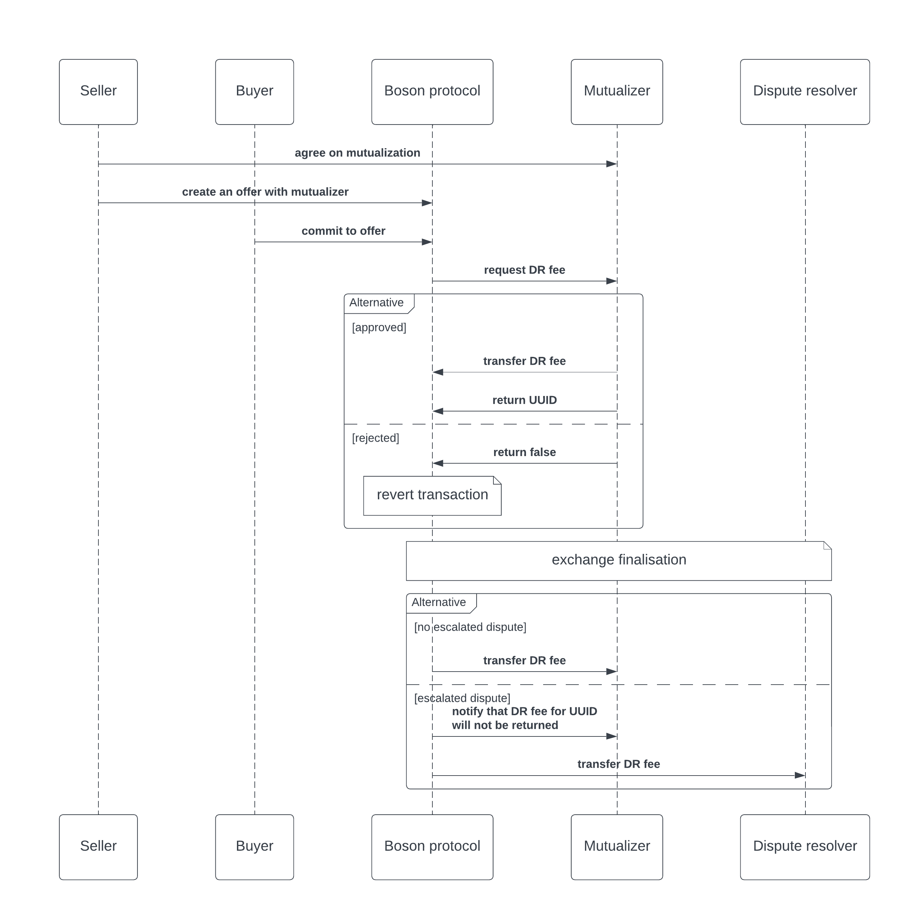

## Abstract
This proposal describes a minimal interface to support mutualization of dispute resolver fees.

## Motivation
Dispute resolver fee is paid for the service provided by the Dispute resolver. The simplest approach is that either seller or buyer pays it, but none of them is unsuitable:
- If the seller has contributed towards the fee, a buyer is unilaterally able to cause the seller a loss by calling `escalate`.
- If the buyer has contributed towards the fee, the Buyer is discouraged from calling `escalate` because that action will incur them a cost.

A solution to this problem is to mutualize the dispute resolution fees (DRF) by creating an open insurance market that covers the fee when dispute resolution services are sought.
It's possible to insure either buyers or sellers. In both cases, they pay a premium to the mutualizer, which then bears the cost of escalated dispute resolution if it comes to it.
Given that the sellers are expected to be permanently present in the system, while some buyers will be only one-time users, it makes more sense to mutualize across the sellers.

Mutualizer is a contract external to the protocol. It can specify arbitrary insurance policies and can implement custom business logic.
To be compatible with the protocol it must implement the methods to send the DR fee to the protocol when requested and must be able to receive the outcome of the dispute resolution.

This BPIP proposes the following interfaces:
- a minimal mutualizer interface. This is the interface that is used by the protocol to request DR fee from the mutualizer and to communicate back the final outcome.
- a mutualizer client interface. This is used by the mutualizer owner to deposit and withdraw funds and to create and void agreements. It is also used by the sellers to create or void agreements.

The interactions between mutualizer, seller and protocol are presented in the following diagram:



1. Seller and mutualizer first agree on mutualization and store the information on the mutualizer contract.
2. When the buyer commits to an offer, the DR fee is pulled from the mutualizer and locked in the protocol
   1. If the mutualizer cannot provide the fee, the commit fails and the state is reverted (no buyer/seller funds get locked, and no voucher is issued) 
3. When an exchange is finalised, the DR fee is released to:
   1. *Dispute resolver* if a dispute was raised and escalated and the resolver did not refuse to resolve
   2. *Mutualizer* if no dispute was raised or dispute was raised and the resolver refused to resolve.


## Specification
#### Minimal DR Fee Mutualizer interface

```solidity
/**
 * @title IDRFeeMutualizer
 *
 * @notice This is the interface for the Dispute Resolver fee mutualizers.
 *
 * The ERC-165 identifier for this interface is: 0x41283543
 */
interface IDRFeeMutualizer {
    event DRFeeRequsted(
        address indexed sellerAddress,
        address _token,
        uint256 feeAmount,
        address feeRequester,
        bytes context
    );

    event DRFeeSent(address indexed feeRequester, address token, uint256 feeAmount, uint256 indexed uuid);
    event DRFeeReturned(uint256 indexed uuid, address indexed token, uint256 feeAmount, bytes context);

    /**
     * @notice Tells if mutualizer will cover the fee amount for a given seller and requested by a given address.
     *
     * It checks if agreement is valid, but not if the mutualizer has enough funds to cover the fee.
     *
     * @param _sellerAddress - the seller address
     * @param _token - the token address (use 0x0 for ETH)
     * @param _feeAmount - amount to cover
     * @param _feeRequester - address of the requester
     * @param _context - additional data, describing the context
     */
    function isSellerCovered(
        address _sellerAddress,
        address _token,
        uint256 _feeAmount,
        address _feeRequester,
        bytes calldata _context
    ) external view returns (bool);

    /**
     * @notice Request the mutualizer to cover the fee amount.
     *
     * @dev Verify that seller is covered and send the fee amount to the msg.sender.
     * Returned uuid can be used to track the status of the request.
     *
     * Reverts if:
     * - caller is not the protocol
     * - agreement does not exist
     * - agreement is not confirmed yet
     * - agreement is voided
     * - agreement has not started yet
     * - agreement expired
     * - fee amount exceeds max mutualized amount per transaction
     * - fee amount exceeds max total mutualized amount
     * - amount exceeds available balance
     * - token is native and transfer fails
     * - token is ERC20 and transferFrom fails
     *
     * @param _sellerAddress - the seller address
     * @param _token - the token address (use 0x0 for ETH)
     * @param _feeAmount - amount to cover
     * @param _context - additional data, describing the context
     * @return isCovered - true if the seller is covered
     * @return uuid - unique identifier of the request
     */
    function requestDRFee(
        address _sellerAddress,
        address _token,
        uint256 _feeAmount,
        bytes calldata _context
    ) external returns (bool isCovered, uint256 uuid);

    /**
     * @notice Return fee to the mutualizer.
     *
     * @dev Returned amount can be between 0 and _feeAmount that was requested for the given uuid.
     *
     * - caller is not the protocol
     * - uuid does not exist
     * - same uuid is used twice
     * - token is native and sent value is not equal to _feeAmount
     * - token is ERC20, but some native value is sent
     * - token is ERC20 and sent value is not equal to _feeAmount
     * - token is ERC20 and transferFrom fails
     *
     * @param _uuid - unique identifier of the request
     * @param _feeAmount - returned amount
     * @param _context - additional data, describing the context
     */
    function returnDRFee(uint256 _uuid, uint256 _feeAmount, bytes calldata _context) external payable;
}
```

#### DR Fee Mutualizer Client interface

```solidity
/**
 * @title IDRFeeMutualizerClient
 *
 * @notice This is the interface for the Dispute Resolver fee mutualizers.
 *
 * The ERC-165 identifier for this interface is: 0x391b17cd
 */
interface IDRFeeMutualizerClient is IDRFeeMutualizer {
    struct Agreement {
        address sellerAddress;
        address token;
        uint256 maxMutualizedAmountPerTransaction;
        uint256 maxTotalMutualizedAmount;
        uint256 premium;
        uint128 startTimestamp;
        uint128 endTimestamp;
        bool refundOnCancel;
    }

    struct AgreementStatus {
        bool confirmed;
        bool voided;
        uint256 outstandingExchanges;
        uint256 totalMutualizedAmount;
    }

    event AgreementCreated(address indexed sellerAddress, uint256 indexed agreementId, Agreement agreement);
    event AgreementConfirmed(address indexed sellerAddress, uint256 indexed agreementId);
    event AgreementVoided(address indexed sellerAddress, uint256 indexed agreementId);
    event FundsDeposited(address indexed tokenAddress, uint256 amount, address indexed depositor);
    event FundsWithdrawn(address indexed tokenAddress, uint256 amount);

    /**
     * @notice Stores a new agreement between mutualizer and seller. Only contract owner can submit an agreement,
     * however it becomes valid only after seller confirms it by calling payPremium.
     *
     * Emits AgreementCreated event if successful.
     *
     * Reverts if:
     * - caller is not the contract owner
     * - max mutualized amount per transaction is greater than max total mutualized amount
     * - max mutualized amount per transaction is 0
     * - end timestamp is not greater than start timestamp
     * - end timestamp is not greater than current block timestamp
     *
     * @param _agreement - a fully populated agreement object
     */
    function newAgreement(Agreement calldata _agreement) external;

    /**
     * @notice Pay the premium for the agreement and confirm it.
     *
     * Emits AgreementConfirmed event if successful.
     *
     * Reverts if:
     * - agreement does not exist
     * - agreement is already confirmed
     * - agreement is voided
     * - agreement expired
     * - token is native and sent value is not equal to the agreement premium
     * - token is ERC20, but some native value is sent
     * - token is ERC20 and sent value is not equal to the agreement premium
     * - token is ERC20 and transferFrom fails
     *
     * @param _agreementId - a unique identifier of the agreement
     */
    function payPremium(uint256 _agreementId) external payable;

    /**
     * @notice Void the agreement.
     *
     * Emits AgreementVoided event if successful.
     *
     * Reverts if:
     * - agreement does not exist
     * - caller is not the contract owner or the seller
     * - agreement is voided already
     * - agreement expired
     *
     * @param _agreementId - a unique identifier of the agreement
     */
    function voidAgreement(uint256 _agreementId) external;

    /**
     * @notice Deposit funds to the mutualizer. Funds are used to cover the DR fees.
     *
     * Emits FundsDeposited event if successful.
     *
     * Reverts if:
     * - token is native and sent value is not equal to _amount
     * - token is ERC20, but some native value is sent
     * - token is ERC20 and sent value is not equal to _amount
     * - token is ERC20 and transferFrom fails
     *
     * @param _tokenAddress - the token address (use 0x0 for native token)
     * @param _amount - amount to transfer
     */
    function deposit(address _tokenAddress, uint256 _amount) external payable;

    /**
     * @notice Withdraw funds from the mutualizer.
     *
     * Emits FundsWithdrawn event if successful.
     *
     * Reverts if:
     * - caller is not the mutualizer owner
     * - amount exceeds available balance
     * - token is ERC20 and transferFrom fails
     *
     * @param _tokenAddress - the token address (use 0x0 for native token)
     * @param _amount - amount to transfer
     */
    function withdraw(address _tokenAddress, uint256 _amount) external;

    /**
     * @notice Returns agreement details and status for a given agreement id.
     *
     * Reverts if:
     * - agreement does not exist
     *
     * @param _agreementId - a unique identifier of the agreement
     * @return agreement - agreement details
     * @return status - agreement status
     */
    function getAgreement(
        uint256 _agreementId
    ) external view returns (Agreement memory agreement, AgreementStatus memory status);

    /**
     * @notice Returns agreement id, agreement details and status for given seller and token.
     *
     * Reverts if:
     * - agreement does not exist
     * - agreement is not confirmed yet
     *
     * @param _seller - the seller address
     * @param _token - the token address (use 0x0 for native token)
     * @return agreementId - a unique identifier of the agreement
     * @return agreement - agreement details
     * @return status - agreement status
     */
    function getConfirmedAgreementBySellerAndToken(
        address _seller,
        address _token
    ) external view returns (uint256 agreementId, Agreement memory agreement, AgreementStatus memory status);
}
```

#### BosonTypes
`Offer` is extended with an additional field

```diff solidity
struct Offer {
    uint256 id;
    uint256 sellerId;
    uint256 price;
    uint256 sellerDeposit;
    uint256 buyerCancelPenalty;
    uint256 quantityAvailable;
    address exchangeToken;
    string metadataUri;
    string metadataHash;
    bool voided;
+   address feeMutualizer;
}
```

`DisputeResolutionTerms` is extended with an additional field

```diff solidity
struct DisputeResolutionTerms {
    uint256 disputeResolverId;
    uint256 escalationResponsePeriod;
    uint256 feeAmount;
    uint256 buyerEscalationDeposit;
+   address feeMutualizer;
}
```

#### IBosonOfferHandler and IBosonOrchestrationHandler
Although definitions of methods that create an offer do not change, the type of input parameter `Offer offer` changes. As a consequence, the signatures of all methods that accept `Offer` also change. Affected methods are

- createOffer
- createOfferBatch
- createSellerAndPremintedOffer
- createOfferWithCondition and createPremintedOfferWithCondition
- createOfferAddToGroup and createPremintedOfferAddToGroup
- createOfferAndTwinWithBundle and createPremintedOfferAndTwinWithBundle
- createOfferWithConditionAndTwinAndBundle and createPremintedOfferWithConditionAndTwinAndBundle
- createSellerAndOfferWithCondition and createSellerAndPremintedOfferWithCondition
- createSellerAndOfferAndTwinWithBundle and createSellerAndPremintedOfferAndTwinWithBundle
- createSellerAndOfferWithConditionAndTwinAndBundle and createSellerAndPremintedOfferWithConditionAndTwinAndBundle

## Rationale
Boson protocol requires a standardized approach to communicate and exchange funds with the mutualizer. `IDRFeeMutualizer` provides methods `requestDRFee` and `returnDRFee`. An additional method `isSellerCovered` is a view method that can be used by external users (dApp) to obtain the coverage status before interacting with the protocol (for example, before `commitToOffer`, a buyer could verify if the seller is covered and not submit a transaction if it is not). `IDRFeeMutualizer` is the minimal interface that mutualizer must implement in order to work with the Boson Protocol.

`IDRFeeMutualizerClient` is an extension of `IDRFeeMutualizer`. Although mutualizers are not obliged to use it, it is strongly recommended to ensure higher interoperability with the ecosystem. If multiple mutualizers implement the same client interface, it opens the possibility to establish mutualizer marketplaces and gives the sellers the same experience regardless of the mutualizer they choose.
This interface does not impose any strict implementation requirements, so the mutualizers are free to choose the business model they want to implement.

A seller can choose different mutualizer for each offer. This is sensible since offers might have different face values or different exchange tokens and consequently, DR fees will be different. Since mutualizers can have different policies for different exposures, the seller can always choose the one that fits the offer the best. When an offer is created, the seller adds chosen mutualizer address to the new Offer struct. A zero address is a valid value and it means that the seller wants to cover the DR fees themselves directly from their in-protocol pools.

An offer's mutualizer can later be changed. Reasons for that, among others, are:
- seller wants to go from self mutualize to DR fee mutualizer or vice versa;
- agreement with DR fee mutualizer expires;
- DR fee mutualizer withdraws funds/closes their pool;
- seller finds a cheaper mutualizer;
- etc.  

Most of the offer's properties are immutable to protect the buyer and prevent a front-running attack. However, changing mutualizer is not problematic, since the buyer does not  care who pays the DR fee.
If the mutualizer for some offer is changed, existing exchanges should not be affected, i.e. for DRfee is still returned to the old mutualizer if the dispute was not escalated Only the exchanges that are the result of later commitments, use the new mutualizer.
This can be easily managed by adding `feeMutualizer` field `DisputeResolutionTerms`.


## Backward compatibility
Old offers do not have `feeMutualizer` address, so the protocol will consider all old offers as "self-mutualized". However, this is not problematic, since all existing offers have the DRFee of 0, which is immutable, so current sellers are not affected.

Still, this specification has an impact on previous protocol versions, since the change of `Offer` struct changes signatures of all [methods that create an offer](#ibosonofferhandler-and-ibosonorchestrationhandler), so old methods won't work anymore.

## Implementation

WIP implementation is available [here](https://github.com/bosonprotocol/boson-protocol-contracts/pull/622).
  
## Copyright waiver & license
Copyright and related rights waived via [CC0](https://creativecommons.org/publicdomain/zero/1.0/).
