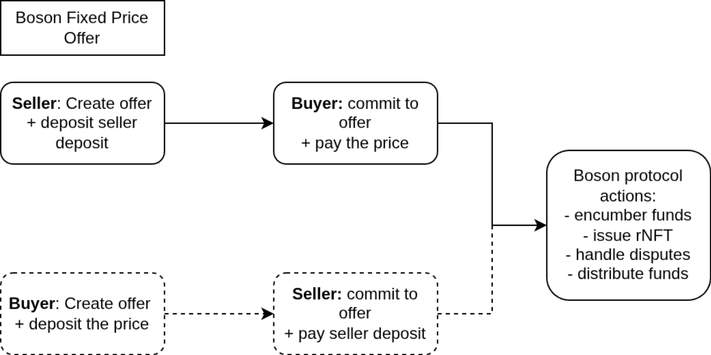

## Abstract
This proposal describes a new way to create Boson protocol offers, which allows buyers to initiate the exchange.

## Motivation
In Boson, the seller always first creates an offer, which can then be discovered by the buyer. When a buyer commits to an offer, they pay the price, which remains encumbered until the exchange is finalised (either the item is delivered and funds are released to the seller, or the dispute is raised and resolved via one of Boson mechanisms)

It doesn’t matter if the offer is with a fixed price or it’s a price discovery offer; it’s always the seller who creates the first step in the protocol.

That could be extended - instead of the seller offering a service or product and asking for a payment, the buyer could offer the payment and ask for a service. Once seller commits to an offer, the Boson Protocol user flows continue as usual. Therefore, all protocol guarantees are preserved.  

This change will extend the protocol usefulness. Often the buyers are seeking for a item or service and the sellers are not aware of the demand. In the era of agentic commerce this is expected to become even more crucial than it is now.

## Specification
#### IBosonFundsHandler
`depositFunds` must allow deposits to buyers.

```diff solidity
    /**
-     * @notice Receives funds from the caller, maps funds to the seller id and stores them so they can be used during the commitToOffer.
+     * @notice Receives funds from the caller, maps funds to the entity id and stores them so they can be used during the commitToOffer.
     *
     * Emits FundsDeposited event if successful.
     *
     * Reverts if:
     * - The funds region of protocol is paused
     * - Amount to deposit is zero
-     * - Seller id does not exist
+     * - Entity id does not exist
     * - It receives some native currency (e.g. ETH), but token address is not zero
     * - It receives some native currency (e.g. ETH), and the amount does not match msg.value
     * - It receives no native currency, but token address is zero
     * - Contract at token address does not support ERC20 function transferFrom
     * - Calling transferFrom on token fails for some reason (e.g. protocol is not approved to transfer)
     * - Received ERC20 token amount differs from the expected value
     *
-     * @param _sellerId - id of the seller that will be credited
+     * @param _entityId - id of the entity that will be credited
     * @param _tokenAddress - contract address of token that is being deposited (0 for native currency)
     * @param _amount - amount to be credited
     */
    function depositFunds(
-        uint256 _sellerId,
+        uint256 _entityId,
        address _tokenAddress,
        uint256 _amount
    ) external payable;
```   

#### IBosonExchangeEvents
A new event is introduced. It is emitted when the seller commits to a buyer-created offer.
````diff solidity
+    event SellerCommitted(
+        uint256 indexed offerId,
+        uint256 indexed sellerId,
+        uint256 indexed exchangeId,
+        BosonTypes.Exchange exchange,
+        BosonTypes.Voucher voucher,
+        address executedBy
+    );

````
Note: instead of having `SellerCommitted` and `BuyerCommitted` events, it could be merged into a single event containing both buyer and seller id.

#### IBosonExchangeHandler

The commit to offer method must allow the seller to call it and encumber the `sellerDeposit` at commitment time. The buyer's payment must already be in the escrow at commitment time.  

Note: `commitToConditionalOffer` does is not changed in this proposal, since conditional offers are meant to restrict the buyers, not the sellers. It makes no sense for a buyer to put an arbitrary restrictions in the offer.

```diff solidity
    /**
     * @notice Commits to a static offer (first step of an exchange).
     *
-     * Emits a BuyerCommitted event if successful.
+     * Emits a BuyerCommitted or SellerCommitted event if successful.
     * Issues a voucher to the buyer address.
     *
     * Reverts if:
     * - The exchanges region of protocol is paused
     * - The buyers region of protocol is paused
+     * - The sellers region of protocol is paused
     * - OfferId is invalid
     * - Offer has been voided
     * - Offer has expired
     * - Offer is not yet available for commits
     * - Offer's quantity available is zero
-     * - Buyer address is zero
-     * - Buyer account is inactive
+     * - Committer address is zero
+     * - Committer account is inactive
     * - Buyer is token-gated (conditional commit requirements not met or already used)
-     * - Offer price is in native token and caller does not send enough
-     * - Offer price is in some ERC20 token and caller also sends native currency
+     * - Offer exchange token is in native token and caller does not send enough
+     * - Offer exchange token is in some ERC20 token and caller also sends native currency
     * - Contract at token address does not support ERC20 function transferFrom
     * - Calling transferFrom on token fails for some reason (e.g. protocol is not approved to transfer)
     * - Received ERC20 token amount differs from the expected value
-     * - Seller has less funds available than sellerDeposit
+     * - Seller has less funds available than sellerDeposit if offer was created by the seller
+     * - Buyer has less funds available than price if offer was created by the buyer
     *
-     * @param _buyer - the buyer's address (caller can commit on behalf of a buyer)
+     * @param _committer - the seller's or the buyer's address. The caller can commit on behalf of a buyer or a seller.
     * @param _offerId - the id of the offer to commit to
     */
-    function commitToOffer(address payable _buyer, uint256 _offerId) external payable;
+    function commitToOffer(address payable _committer, uint256 _offerId) external payable;
```

#### IBosonPriceDiscoveryHandler
```diff solidity
    /**
     * @notice Commits to a price discovery offer (first step of an exchange).
     *
-     * Emits a BuyerCommitted event if successful.
+     * Emits a BuyerCommitted or SellerCommitted event if successful.
     * Issues a voucher to the buyer address.
     *
     * Reverts if:
     * - Offer price type is not price discovery. See BosonTypes.PriceType
     * - Price discovery contract address is zero
     * - Price discovery calldata is empty
     * - Exchange exists already
     * - Offer has been voided
     * - Offer has expired
     * - Offer is not yet available for commits
+     * - Committer address is zero
+     * - Committer account is inactive
     * - Buyer is token-gated (conditional commit requirements not met or already used)
     * - Any reason that PriceDiscoveryBase fulfilOrder reverts. See PriceDiscoveryBase.fulfilOrder
     * - Any reason that ExchangeHandler onPremintedVoucherTransfer reverts. See ExchangeHandler.onPremintedVoucherTransfer
     *
-     * @param _buyer - the buyer's address (caller can commit on behalf of a buyer)
+     * @param _committer - the seller's or the buyer's address. The caller can commit on behalf of a buyer or a seller.
     * @param _tokenIdOrOfferId - the id of the offer to commit to or the id of the voucher (if pre-minted)
     * @param _priceDiscovery - price discovery data (if applicable). See BosonTypes.PriceDiscovery
     */
    function commitToPriceDiscoveryOffer(
-        address payable _buyer,
+        address payable _committer,
        uint256 _tokenIdOrOfferId,
        BosonTypes.PriceDiscovery calldata _priceDiscovery
    ) external payable;
```

## Rationale
The offer creation phase in the protocol serves as an offer discovery mechanism. Parameters for a successful exchange should not depend on the offer creator (seller or buyer). For the protocol it is only relevant that the correct amount is encumbered at commitment time. Afterwards, the flows should be unaffected.



## Backward compatibility
This specification does not break backward compatibility. It should work for both static and price-discovery offers.

## Implementation
* Create offer
  * Store the information who created the offer. The existing offers should default to "seller"
* Commit to offer
  * Accept committer address, which can be either a buyer or a seller
  * If seller-created offer:
    * Check that seller has at least the `sellerDeposit` in available funds end encumber them
    * Validate that the buyer paid the `price`
  * If buyer-created offer:
    * Check that buyer has at least the `price` in available funds end encumber them
    * Validate that the seller paid the `sellerDeposit`
  * All existing validations in commit to offer should remain in place
  * If any validation fails, revert
* Deposit funds
  * Release the restriction that funds can only be deposited to the seller's available funds
  * All other existing validations should remain the same

### Security considerations

None.
  
## Copyright waiver & license
Copyright and related rights waived via [CC0](https://creativecommons.org/publicdomain/zero/1.0/).
